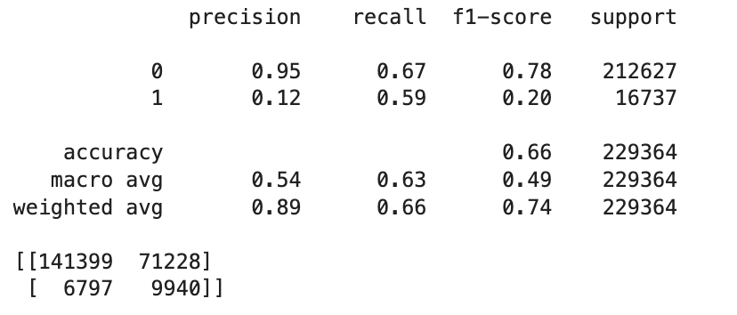

### Predicting Multiple Births from CDC Natality Data

**Ariel Alas**

#### Executive summary

#### Rationale
This project explores the use of machine learning to predict whether a woman is likely to have a multiple birth (twins or more) based on publicly available CDC natality data. The goal is to provide early insights that could support prenatal planning and resource allocation in clinical settings. A baseline logistic regression model was implemented, and initial results show promising recall for identifying multiple births, with room for improving precision in future iterations.

#### Research Question
Can we predict whether a pregnancy will result in a multiple birth using demographic and prenatal factors reported in natality records?

#### Data Sources
 - Data: CDC Natality Public Use Files 2023
 - Link: https://www.cdc.gov/nchs/data_access/vitalstatsonline.htm

#### Methodology
1. Feature extraction: Selected 20 features from the raw fixed-width natality file.
2. Data cleaning:
   - Imputed missing values using median/mode strategies;
   - Applied winsorization (1st–99th percentile capping) to handle outliers.
3. Feature encoding:
   - Mapped binary categorical values (Y, N, U, X) to numeric (1/0)
   - One-hot encoded for a categorical variable
4.	Train-test split: Used train_test_split with stratification to preserve class balance.
5.	SMOTE: Applied to training set only to oversample the minority class (multiple births).
6.	Modeling: Trained a baseline Logistic Regression model with feature scaling (StandardScaler).
7.	Evaluation: Used classification report and confusion matrix to assess performance.

#### Results
The baseline logistic regression model produced the following metrics:

 - The model is highly precise at identifying single births and has moderate recall for multiple births.
 - Recall of 59% for the minority class shows that SMOTE helped the model learn the signal for rare outcomes.

#### Next steps
- Train and compare tree-based models (Random Forest, XGBoost) to improve precision while maintaining recall.
- Utilize hyperparameter tuning (GridSearch) to optimize model performance.

#### Outline of project

- [Notebook](https://github.com/AriAlas/ML-AI-Capstone/capstone)

##### Contact and Further Information
For questions or further collaboration, please contact: arieru@gmail.com
